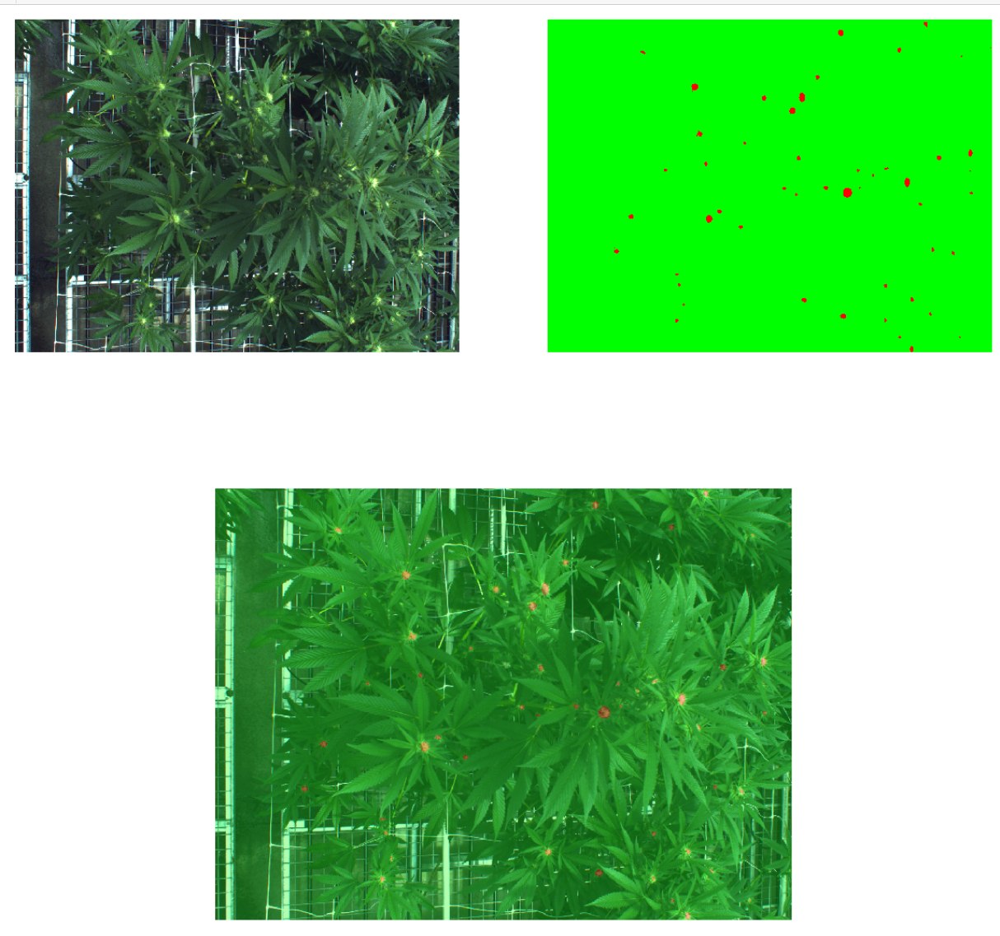
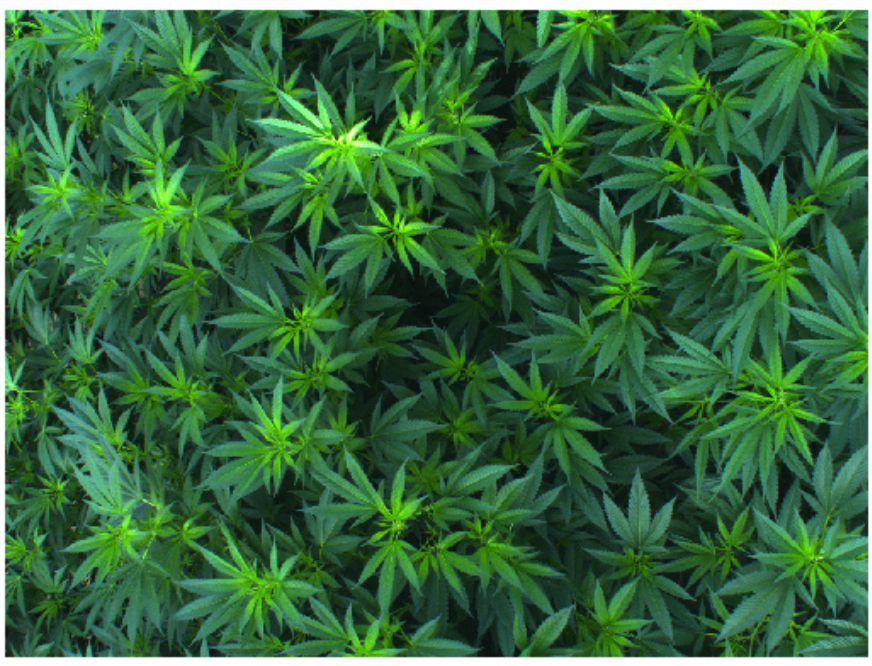
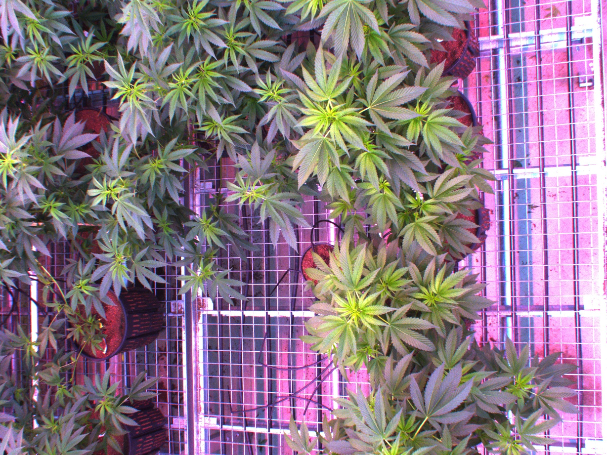

# Bud Annotation Instructions

Annotated buds images looks like this when overlaid on top of the original image:

Example 1:

Buds (red on the top-right image, above).

Example 2:

## Format

Annotations saved as BMP files in one of the two formats:

1. Each pixel that is a bud is set to 1, the rest (background) - to 0.
2. Alternatively the mask may be saved as RGB, where the non-buds are green RGB: (0, 255, 0), and buds are red: (255, 0, 0)

### The following images contains NO buds

