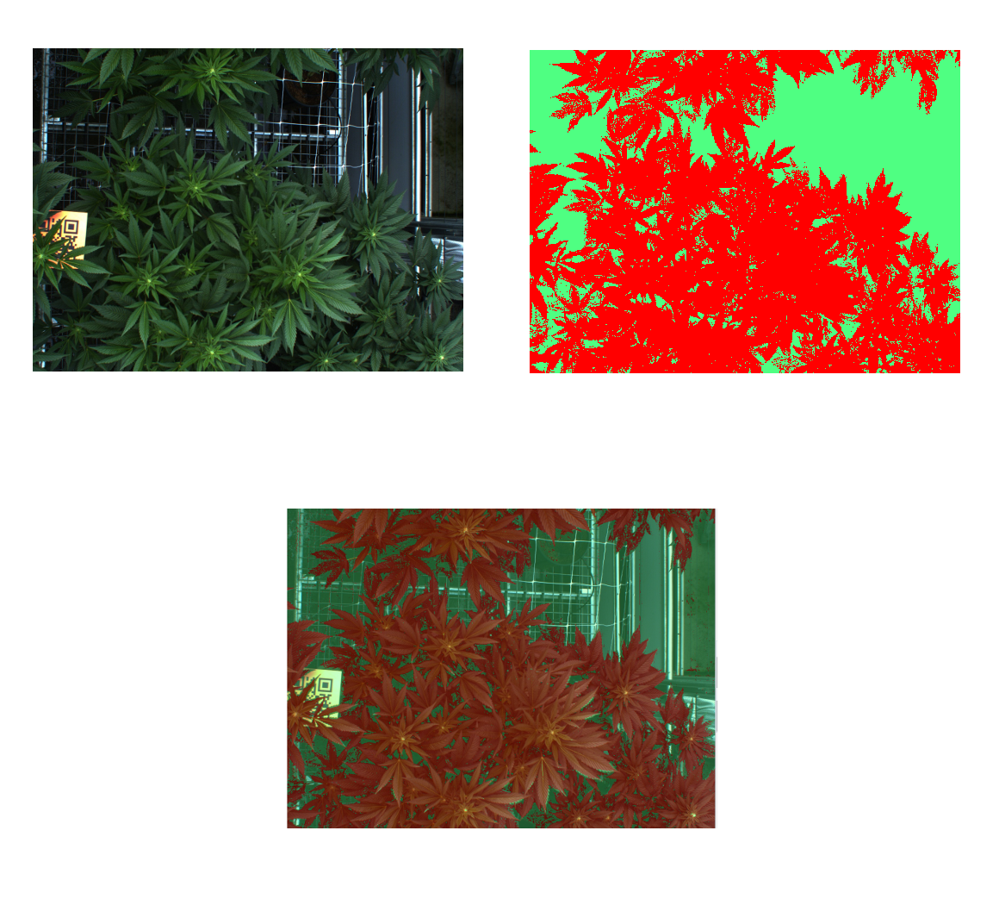

# Canopy Annotation Instruction

An annotated canopy image looks like this when overlaid:

Canopy (red on the top-right image, above) consists of all vegetative material, including leaves, stems, and buds.  Everything else is background, and masked with the green color.

## Format

Prefer the annotations saved as PNG files in one of the two formats:

1. Each pixel that is a bud is set to 1, the rest (background) - to 0 in an originally gray scale image.
2. Alternatively the mask may be saved as RGB (also in PNG format), where the non-buds are green RGB: (0, 255, 0), and buds are red: (255, 0, 0)

