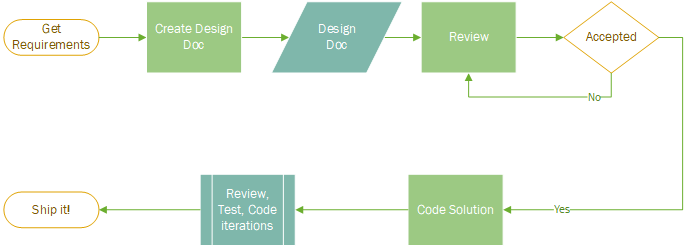

# Design and Development Principles

## Purpose

This is a declaration of our design and coding principles. This document is _not_ meant to discuss all aspects of the software development process in general or as they are applicable to Team Helio in particular. We all know about DUTs, TDD, continuous integration, agile, Jira, etc. We should however agree on some basic principles of style, organization, and methodology that will drive our development.

## Basic Principles

Well engineered code does not just solve a problem. It solves a problem over _time_ in a _team_ environment. This means that code has the following properties:

### Componetization / Layering

There should be a clear deconstruction of a problem into interacting components. E.g. mission critical apps are usually split into data, business, and application (user) layers.

### Extensibility

It is a safe bet that the problem being solved will evolve. In which case the system solving it must be extended (e. g. the company adds a new type of database it is now supporting. The data layer of an application should be extended easily to accommodate this new requirement).

### Reusability

Whatever action the component is performing it must perform it in any reasonable conditions: an application layer should be reused without code changes even if the underlying database is replaced. This also means refactoring highly repetitive code into components that are parameterized and reused.

### Maintainability

Design choices must be made with regard to the future and the people. The system will evolve. Other engineers will look at the code and will need to study and extend it. The code has to be self-documenting and navigable. Intentions should be made clear and side-effects should not be hidden.

### Document, document, document

This is part of the maintainability principle but since it is crucial to document at each phase of the development process, and nobody likes to do it, I separated it into its own subsection.

Given our team specifics (we are an R & D team with a long-term vision of building DS/AI system) I propose the following guidelines for future development.

## Process



This diagram zooms in on the design process. It is _essential_ that we _treat design docs as deliverables_.

### Design Guidelines

The design document should be the first _deliverable_ and its only goal is to communicate our intentions clearly as well as jump-start development process.

When writing a design doc we must get rid of the knowledge bias, i.e. an impression that our readers already know what we are going to tell them. Thoughts should be clearly formulated and, even better, clearly illustrated.

It is a given, that during coding original intentions will change 10,000 times (or more). However there is nothing like a written document to jump start immersion into code. Both for the original writer and any engineers that will inherit the project.

#### Design Document Structure

Structure helps succinct communication by providing a matrix to frame our thoughts. The design doc should have the following sections:

* Motivation
* Scope
* Workflow
* Details
* Hardware / Software Requirements
* Crude Timeline
* Alternatives (optional)

The **Scope** section should just list goals very briefly as well as non-goals.

**Workflow** should have a diagram of interacting components.

**Details** each of the components should be described in some detail with examples and drawings if reasonable.

The rest of the sections are self-explanatory.

### Development Guidelines

This section is meant to streamline but not stifle creativity.

#### Language

We picked Python as a dynamic, expressive and highly performant development ecosystem. These principles are formulated with these properties in mind.

Since Python 2.7 is being deprecated we should be standardizing on Python 3.5. However, to be mindful of the legacy code, we should be using ```__future__``` imports. (```division``` and ```print_function``` are obvious ones.)

We should be using the **Python 3.5 print syntax**.

#### Naming

The code should _talk_ to anyone who reads it. The most basic and most important way to achieve this is **object naming**. We are not saving screen space, so let's go nuts and explain what the function is doing:

`convert_unet_mask_to_image_and_save` - is a great function name. Not only it explains what the function main goal is but also mentions a side effect.

`do_this_thing` is indeed terrible.

Same goes for **variable names**. `n_classes` rather than just `n`. If there is no clear semantic - give it a one-character name. Two or three characters abbreviating something like `src` or `dest` is ok too. `tifl` is horrible `test_image_file` should be used instead.

Use underscores liberally: they make code readable: `threadsperblock` is a thorn in my eye. `threads_per_block` is good.

(I learned all this from Google. From what I heard, reviewers there are brutal as far as naming)

#### Style

We'll follow [pep-8](https://www.python.org/dev/peps/pep-0008/) within reason:

* `var_name` for local variables
* `CamelCaseClass` for type names (classes)
* `_private_var` for private class variables if it'll help (I hate this but it is useful sometimes)

Tabs should be spaced, and the rest is "common sense" - the code should be readable.

#### Docstrings, Comments

Each important function should have a docstring, describing each of the parameters and a return if applicable:

```python
def unet_proba_to_class_masks(labels):
    '''
    Convert each entry in the label array of predictions from probability
    to actual class-number mask
    Parameters:
        labels -- N x H x W x C (C - number of classes) numpy array
    Returns:
        N x H x W numpy array of masks
    '''
```

Since there are no strong types in Python explaining what the type of an argument is helps a lot to anyone who is going to read the code.

Comment on _why_ or _what_ rather than _how_.

#### Object-Orient and Functional Principles

Not outlining all of those, but just a couple of basic rules of thumb:

1. Hiding side effects is terrible. If we write ```a.img = bgr_img``` the reader has no idea that beyond assignment the image is converted to grayscale and saved to a .jpg file as a side effect. It may take them time to figure out where this conversion and persisting happens and they will certainly never suspect the innocent assignment.
2. Entanglements, deep loops, deep list comprehensions and any other kind of spaghetti should not be allowed. If that is what comes out - the approach needs to be re-evaluated.
3. Code duplications should all be refactored. I heard that there are cases where they are ok, and while I agree, I have never seen a case where that would be true.

#### Performance

The basic rule of performance - know where your performance is going.

To optimize regular code: We should use ```numba``` to speed it up. It works miracles with just one ```@jit``` decorator and is part of the Anaconda ```accelerate``` package.

For those of us who prefer not to use it - we should give extra thought to vectorizing numpy code if there are loops over numpy arrays (remembering broadcasting rules among other things helps). Vectorization may speed up the code by the factor of a hundred compared to regular Python and makes it more readable. It should probably be preferred to the ```@jit``` attribute in cases where performance is not crucial.

[Here](https://github.com/iunullc/machine-learning-sdk/blob/master/sandbox/CUDA%20Test.ipynb) is the comparison of different optimization methods.
