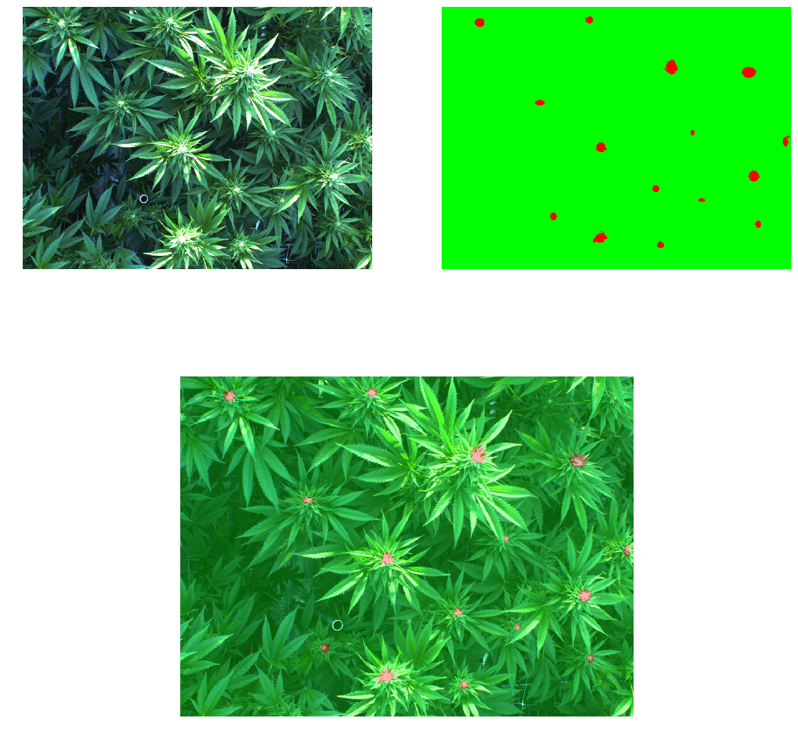
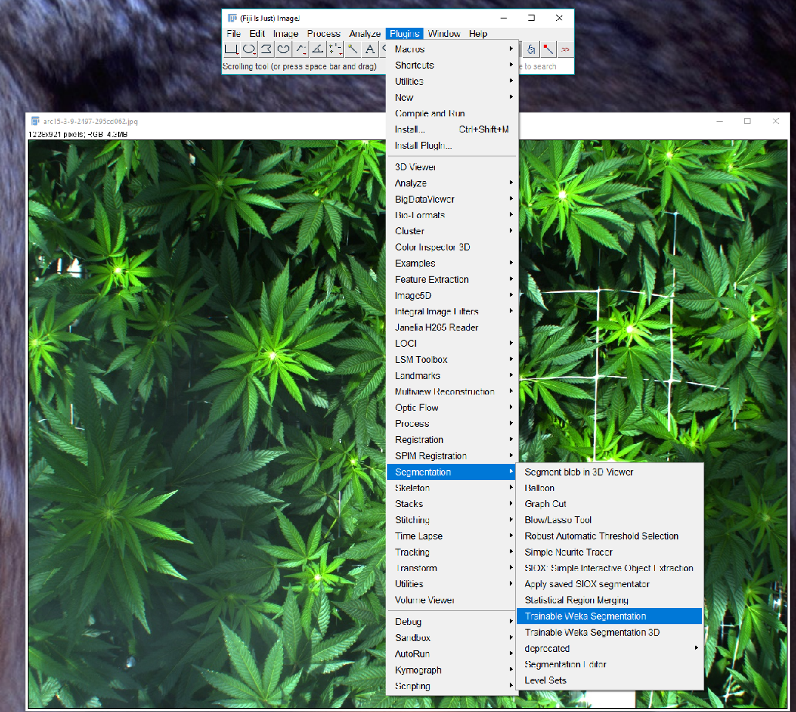
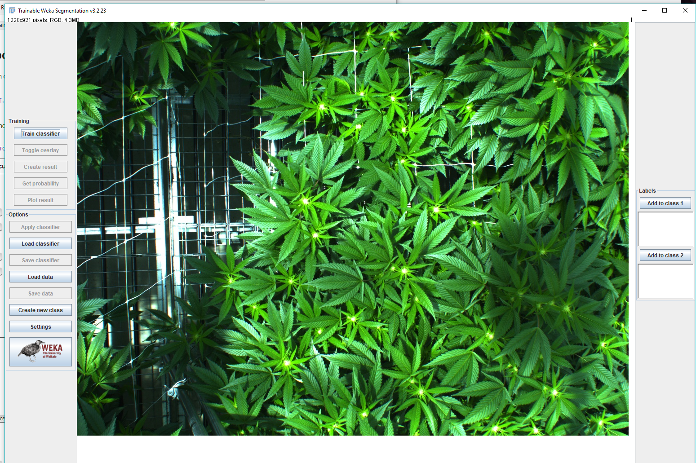
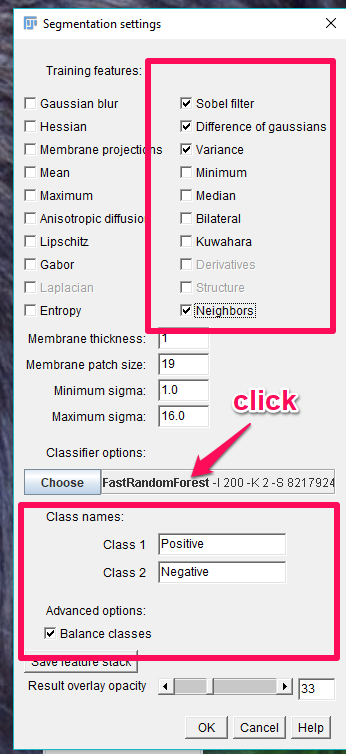
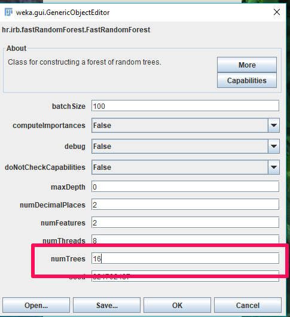
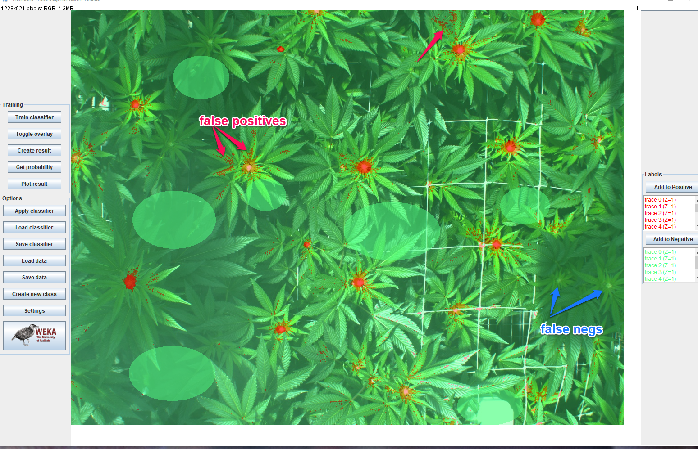
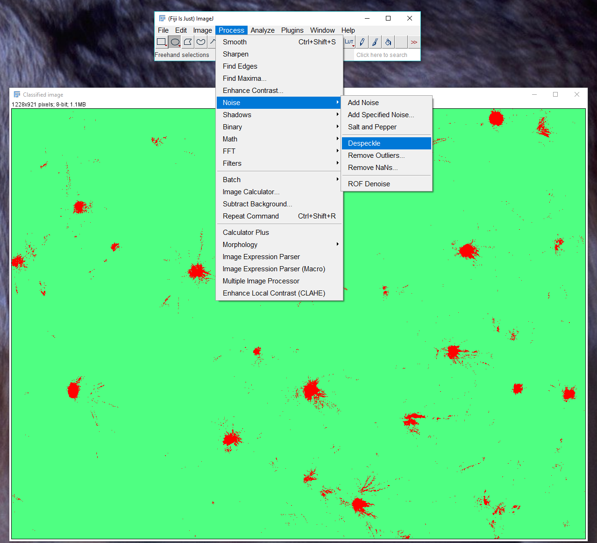
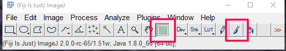
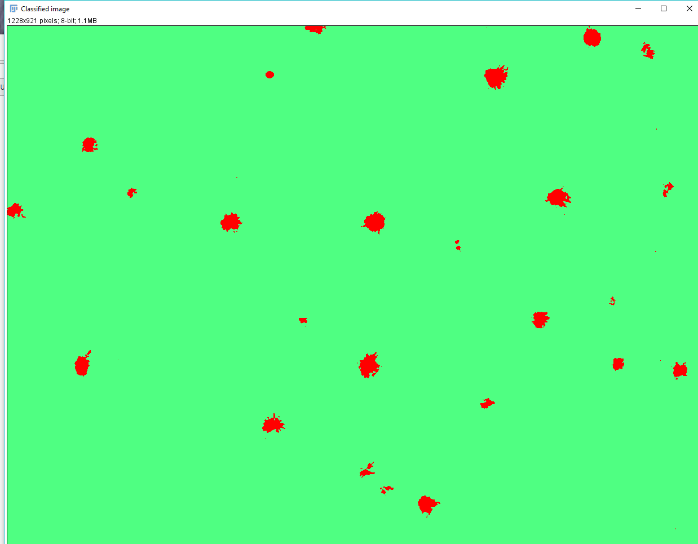

# Annotating Images Using Fiji

For each image we need to produce one or more _masks_ (annotations). A mask is an image having the same size as the original image, with each pixel of interest set to one color and all other pixels set to another color.  For example:

Here, the mask indicates which pixels of the original image belong to buds.  This mask describes two _classes_.  One class is 'buds', and the other class is 'not buds'.

We use a machine learning tool called Fiji to help create masks. You'll show Fiji examples of the class you're masking, and Fiji will produce the mask.  Most likely, the mask will be pretty good but not perfect.  You will then touch up the mask to produce results of a consistent quality.

## Procedure

### Setup

All images which need masking can be found on gdrive, in IUNU Team Folder / Assembly / Labelling / To Do.  Here you'll find a folder with your name, and within that a folder for each class.

* Make sure you have the following folder structure on your computer:

* `labelling`
    * `images`
    * `masks`

* Make sure the `images` and `masks` folders are empty.

* Copy the images you're working with from gdrive into the `images` folder.

* Pick a single image file, and move it from `images` to `masks`.  You will now create a mask, and save it over this image file.  The purpose of this is that an image and its mask need to have the same name, and this is a convenient way of keeping track of which image you're masking.

### Load an Image into Fiji

* In Fiji, choose *Plugins* -> *Segmentation* -> *Trainable Weka Segmentation*

* Browse to the image that you just moved into the `masks` folder.

### Change Fiji Settings

Every time you load an image, you need to change some settings.

* Click the *Settings* button, make sure the dialog box looks like this:

* Click on the **FastRandomForest** caption (not the button next to it).

* Change the **numTrees** parameter of the classifier as shown. *OK* to close the dialog.

### Mark the Image

A mask divides an image into two classes.  For each mask, we need to give Fiji sufficient samples of both classes. For example, if we're making a buds mask, we need to give samples of pixels that make up *buds*, and pixels that make up *not buds*.  Try to give Fiji an idea of what all of the buds in a given image look like.  If some buds are brightly lit, and others are darker, provide a sample of each.  Clearly, *not buds* is a broader classification than *buds*, so you'll need to provide samples of all things in an image that are not buds, including leaves, stems, dirt, plastic, metal, etc.

Check out this screencast https://drive.google.com/file/d/1WuIxlKY50engEKpLrIBDDP2LlSF3iDug/view.

* Use the Squiggly Line tool to make a mark over a bud on the image.  All pixels under this mark will be added to the sample.

* Click the *Add to class 1* button.  The mark will be colored red.  Use class 1 for the primary class.

    Make sure that all pixels underneath the mark are truly indicative of the item you're masking!  If you tell Fiji that a pixel is a bud pixel but it's not, Fiji will get confused.

    You can drag and move a mark if you put it in the wrong location.

    If you make a mark and then decide that you don't want to add to a class, just click somewhere else in the image.

    To remove a mark that has already been added to a class, you'll need to find the offensive mark in the list underneath the *Add to class* button, and double click it.

    To change the width of your Squiggly Line tool, double click on the squiggly line button. Enter a number.  This is the width in pixels of the line.

### Check the Results

After you've provided samples for both classes, you can preview how Fiji will create the mask.

* Click the *Train classifier* button.  The first time you do this for a given image may take a few minutes.  If you retrain, it will go much faster.

    When Fiji is done, a mask overlay will be displayed.

    You can turn this overlay on and off by clicking the *Toggle overlay** button.

* Carefully examine the overlay and the image beneath. 

    Look for areas that Fiji misclassified.  In our example, Fiji will likely mistakenly classify non-bud pixels as buds.  You should create a new sample, with these misclassified pixels, and add the sample to the *Not Buds* class, class 2.  Do the same for bud pixels misclassified as *Not Buds*.  Add new samples, then retrain the classifier.

### Create a Mask:

* After you're satisfied that Fiji is doing its best, click the *Create result* button.  

    Fiji will show the mask.

* Click on the newly created mask, and choose *Process* -> *Noise* -> *Despeckle*.  

    Fiji will remove some noise from the image.

### Save the Mask:

After it's been despeckled, choose *File* -> *Save As* -> *PNG*.

Browse to the image file that you moved into the 'Masks' folder.

Click on that image file.  This will put the file's name into the *Name* textbox.

Click the *Save* button.  The original image will be overwritten with the newly created mask.

### Mask Touchup

Fiji can only do so much.  Usually, you will need to correct misclassified pixels.

### To select a color:

In Fiji, click on the eyedropper tool.  It's right next to the Hand tool.

Click on the mask image.  The color you clicked on will become the current color.  You can tell because the eyedropper tool _itself_ changes color.  This took me nearly two years to notice.

I recommend using the Pencil or Paintbrush tool to correct the mask.  You can double-click it to set its width.

After making changes, you can just choose *File* -> *Save from the menu, since you've already saved the mask with the correct name as described above.

When finished, the mask should have only red pixels above the primary class, and all visible instances of the item being classified should be covered with red pixels.  The same for green.

### Moving On

After you've created a mask, close all of the image windows in Fiji.  You can leave the tools window open.  To repeat the process, load the next image as described above, in *Load an Image* (or type _Shift-O_ to advance to the next image)
