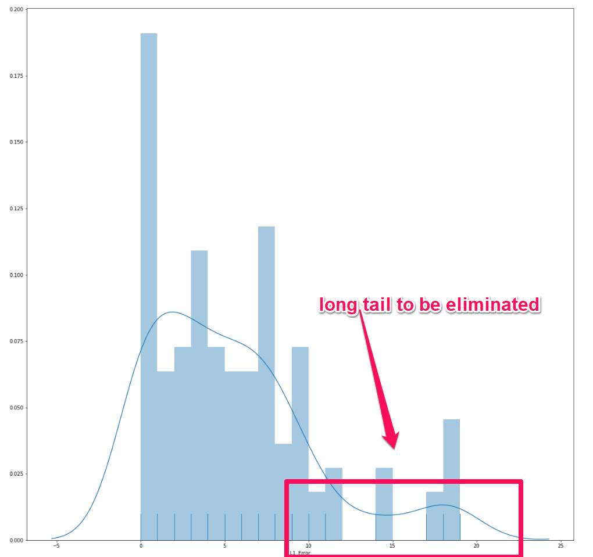

# Validating a Model

## Setup

Every dataset in the CV database consists of images representing a grow at a given time and place (actual greenhouse).

For instance, the full dataset for NextG3N contains 160 images. We compartmentalize our testing based on these settings.

## Steps

1. For each space query for full datasets over the course of the last day
2. Randomly pick 1 (or more if we can annotate images fast) dataset per space
3. For each selected dataset, pick 10 images at random (more is better, limited by our annotation capabilities)
4. For each set of these images, compute absolute error distribution and MAE (mean average error)
5. Wherever the distribution features a long tail, select the images similar to the ones responsible for it for model enhancement (annotate, re-train)
6. The model is ready when the long tail error for each distribution does not exceed 10 (maybe even less than that).

