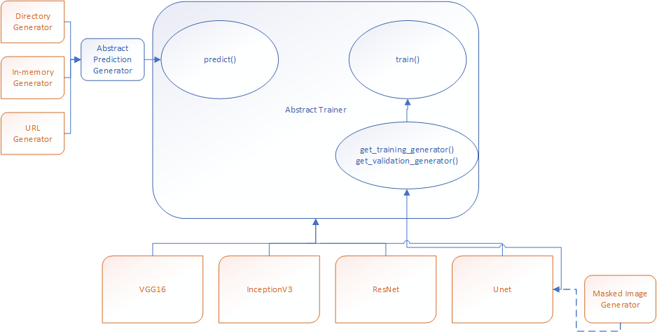

# IUML SDK Architecture

## Summary

IUML SDK is created to seepd up setting up machine learning labs and pipelines fitting to iUNU goals. It has these basic components:

1. Annotator - a simple script used to label images
2. Embedding Generator (embeddings are now called "Projections" in TensorBoard)
3. Training - the main component for training/inference
4. Tools - utilities

## Training

The goal of this component is to encapsulate enough required steps to enable very quick creation of labs (Jupyter notebooks, scripts) using already supported neural nets, as well as fast on-boarding of the new ones.

These goals are accomplished through encapsulation, modularity, and polymorphism.

Here is the diagram:

### Abstract Trainer (`TrainClassifierBase`)

Implements all of generic training functionality (setting up parameters, training, inference) and leaves concrete details (preprocessing function, default image sizes, specific parameters, model setup) to its derivations.

This module is separated from any possible data pipelines. This allows for implementation of generic `train()` and `predict()` methods, that are only written once and work for all possible networks that are on-boarded or may be brought on-board in the future. This works because `train()` and `predict()` call their versions of `keras fit(predict)_generator` and are agnostic as to how the data actually gets to them.

**Note:** Right now classifiers have a separate property `rescale`. This needs to be merged with each classfier preprocessing function, or it may cause problems during inference.

### Abstract Prediction Generator (`IumlPredictionGenerator`)

Base class responsible for any and all data fed to the `predict` function. The only function that requires implementation is `retrieve(index_array)`, that, given an array of indices retrieves images corresponding to these indices. The index may be an index into a list of image files or URLs or any array of images.

The generator should also call `set_need_reshape` in constructor to indicate whether an image needs to be resized before being sent to `predict`, as well as `num_images` property that determines the number of images to run inference on.

**Note:** For the most basic cases, the existence of this generator is hidden from the user. Calling `predict(dir=my_directory)` will pick the right generator and do everything behind the scenes. `predict` may also be called with `data=` and `urls=` to feed it the data currently loaded into memory or a list of image URLs

### Training Generator

This abstraction is implemented in a different way (for legacy reasons). When on-boarding a classifier that takes its inputs from the file system, nothing needs to be done as `get_training_generator` and `get_validation_generator` default implementations will do the right thing and create appropriate Keras image generators (instances of `ImageDataGenerator` class).

For anything Keras generators cannot do the above functions need to be implemented when deriving a new classifier from `TrainClassifierBase`. They need to instantiate custom generators. `Unet` implementation provides an example of how it is done (see `unet_small.py`)

## Usage examples

Check out [cvnotebooks repo](https://github.com/iunullc/cvnotebooks) for many labs using the SDK. In particular [bud counting](https://github.com/iunullc/cvnotebooks/blob/master/Notebooks/nextg3n/NextG3N%20Bud%20Counting.ipynb) and [canopy cover](https://github.com/iunullc/cvnotebooks/blob/master/Notebooks/nextg3n/NextG3N%20Canopy.ipynb)
